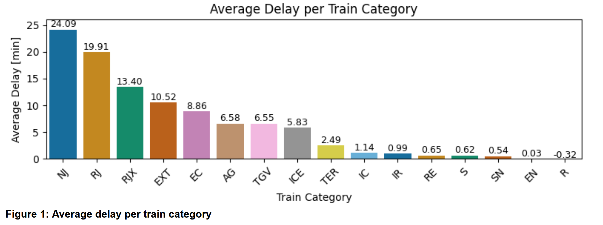
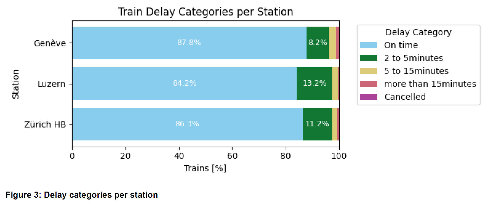
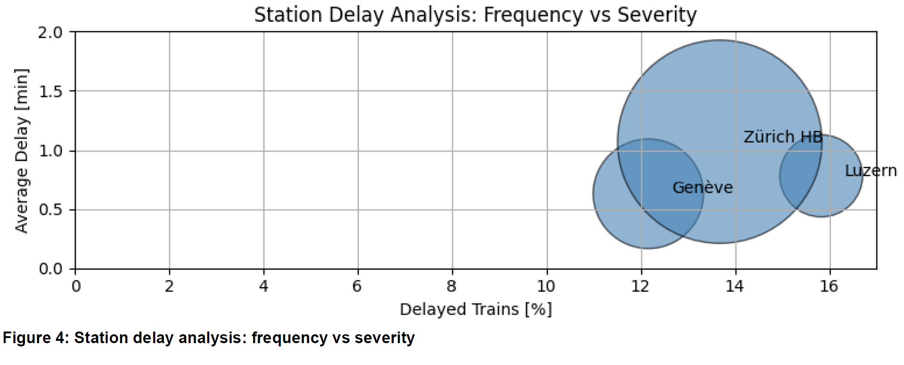
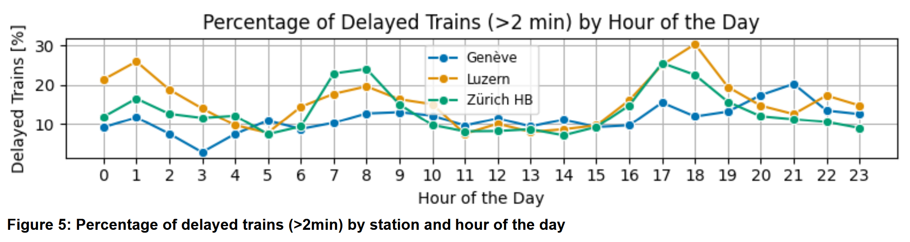
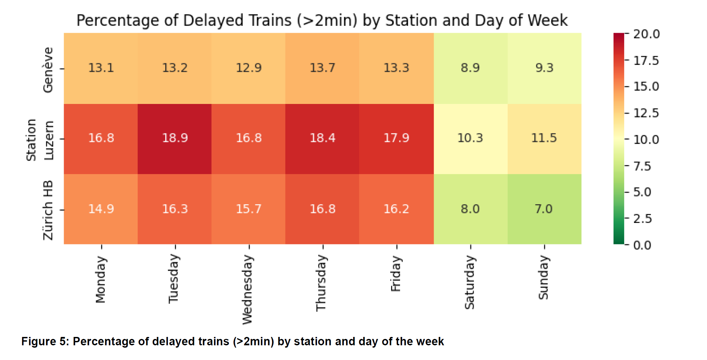

# SBB Train Delays Analysis

This project analyzes train delays in the Swiss public transport system by leveraging real-time and historical data from the Swiss Federal Railways (SBB) APIs and other open transport data sources.

## Table of Contents
- [Introduction](#introduction)
- [Research Questions](#research-questions)
- [Project Structure](#project-structure)
- [Historical Data Pipeline](#historical-data-pipeline)
  - [1. Historical Data Collection](#1-historical-data-collection-zip_scrapperpy)
  - [2. Archive Extraction](#2-archive-extraction-zip_extract_deletepy)
  - [3. Data Filtering](#3-data-filtering-historical_df_intermediatepy)
  - [4. Data Transformation](#4-data-transformation-historical_transformpy)
  - [5. Visualization and Analysis](#5-visualization-and-analysis-historical_data_analysispy)
- [Current Data Pipeline](#current-data-pipeline)
  - [1. API Client](#1-api-client-api_clientpy)
  - [2. Station Board Collection](#2-station-board-collection-station_boardpy)
  - [3. Connections Collection](#3-connections-collection-connectionspy)
  - [4. Main Orchestration](#4-main-orchestration-mainpy)
  - [Data Flow](#data-flow)
  - [Challenges and Limitations](#challenges-and-limitations-of-the-current-data-pipeline)
- [Methodology](#methodology)
  - [Archive & Historical Data](#archive--historical-data)
  - [Current Data](#current-data)
  - [Causes and Disruptions](#causes-and-disruptions)
- [Results and Analysis](#results-and-analysis)
  - [Delay Distribution by Train Category](#delay-distribution-by-train-category)
  - [Station Performance Comparison](#station-performance-comparison)
  - [Temporal Patterns](#temporal-patterns)
- [Conclusion](#conclusion)
- [Setup and Installation](#setup-and-installation)
  - [Requirements](#requirements)
- [Usage](#usage)
  - [Collecting Data for a Specific Month](#collecting-data-for-a-specific-month)
  - [Collecting Data for Multiple Months](#collecting-data-for-multiple-months)
  - [Running the Historical Data Pipeline](#running-the-historical-data-pipeline)
- [Driver Files](#driver-files)
  - [Chromedriver](#chromedriver)
- [Contributors](#contributors)
- [Sources](#sources)

## Introduction

Switzerland depends on public transportation to move more than 1.3 million passengers daily through its Swiss Federal Railways (SBB) network (Baumgartner, 2024). Train delays remain a major problem despite Switzerland's well-known reputation for efficiency and punctuality. The disruptions which arise from infrastructure limitations and maintenance requirements, operational problems and outside factors negatively affect schedule dependability, passenger satisfaction and network efficiency.

Our research project examines train delays by analyzing SBB public API data and additional open data sources because of these problems. The research investigates which train lines and stations experience the most delays and how time and day affect disruptions and whether construction incidents and other delays contribute to these problems.

The project follows a complete data science pipeline starting with data acquisition and transformation followed by analysis and communication.

## Research Questions

The project addresses the following research questions:

1. Are certain train lines or stations more prone to delays than others?
2. How do delays in Switzerland public transport vary by time of the day or day of the week?
3. How do construction and other causes of disruptions impact train delays?

**Future work**: What is the distribution of delays in Swiss public transport across transport modes (type of trains, tram, bus, ship etc.)?

## Project Structure

```
CIP_FS25_106/
│
├── main.py
├── data_collection/
│   ├── __init__.py
│   ├── api_client.py
│   ├── station_board.py
│   ├── historical_data/
│   │   ├── __init__.py
│   │   ├──   zip_scrapper.py  
│   │   ├── historical_df_intermediate.py
│   │   └── zip_extract_delete.py
│   └── connections.py
├── data_processing/
│   ├── __init__.py
│   ├── historical/
|   │   ├── __init__.py
|   │   └── historical_transform.py
├── analysis/
│   ├── __init__.py
│   ├── historical/
│   │   ├── __init__.py
│   │   ├── historical_data_analysis.py  
│   └── delay_analysis.py
├── data/
│   ├── raw/
│   │   ├── YYYY-MM/
│   │   │   ├── Luzern_YYYY-MM-DD.csv
│   │   │   ├── Zürich_HB_YYYY-MM-DD.csv
│   │   │   ├── Genève_YYYY-MM-DD.csv
│   │   │   ├── connection_Zürich_HB_to_Luzern_YYYY-MM-DD.csv
│   │   │   ├── connection_Zürich_HB_to_Genève_YYYY-MM-DD.csv
|   |   │   ├── ...
│   │   │   └── delay_info_YYYY-MM-DD.csv
│   │   └── ...
│   └── historical/
│       ├── downloads_2022/
│       ├── downloads_2023/
│       ├── downloads_2024/
│       └── processed/
│           ├── intermediate_filtered_data.csv
│           └── historical_transformed.csv
├── drivers/
│   └── chromedriver.exe  # For Selenium-based web scraping
├── notebooks/
└── requirements.txt
```

## Historical Data Pipeline

The project implements a comprehensive data pipeline for historical data processing:

### 1. Historical Data Collection (`zip_scrapper.py`)

Downloads ZIP files from the [OpenTransportData Archive](https://archive.opentransportdata.swiss/actual_data_archive.htm) for the years 2022-2024.

- Uses Selenium for web scraping
- Targets specific years (2022, 2023, 2024)
- Saves ZIP files to `data/historical/downloads_YYYY` directories

### 2. Archive Extraction (`zip_extract_delete.py`)

Extracts all downloaded ZIP files and cleans up after extraction.

- Processes all archives by year
- Uses `patoolib` for handling various archive formats
- Deletes ZIP files after successful extraction to save space

### 3. Data Filtering (`historical_df_intermediate.py`)

Processes and filters the raw CSV files to create an intermediate dataset.

- Selects relevant stations (Zürich HB, Luzern, Genève)
- Filters for SBB train services only
- Keeps only essential columns and clean rows (e.g., valid prognosis)
- Processes large files in chunks to manage memory efficiently
- Produces `intermediate_filtered_data.csv`

### 4. Data Transformation (`historical_transform.py`)

Transforms the pre-filtered data to compute train delays and categorize them.

- Converts timestamp columns with mixed formats
- Computes delay in minutes
- Categorizes delays into:
  - `On time`
  - `2 to 5minutes`
  - `5 to 15minutes`
  - `more than 15minutes`
  - `Cancelled`
- Renames columns to standardized English names
- Saves the result to `data/historical/processed/historical_transformed.csv`

### 5. Visualization and Analysis (`historical_data_analysis.py`)

Performs exploratory analysis of the historical train delay data with various visualizations:

- **Overview of delay distribution**: Point plot showing the overall delay distribution
- **Average delay by train category**: Bar chart showing which train types experience the most delays
- **Delay breakdown by station and category**: Stacked horizontal bar chart showing the proportion of each delay category by station
- **Bubble chart of frequency vs severity**: Compares stations by delay frequency and severity
- **Heatmap of delay percentages by weekday**: Shows which days experience more delays at each station
- **Line plot of delay percentages by hour**: Shows how delays vary throughout the day for each station

## Current Data Pipeline

The current data pipeline uses the Swiss Transport API to collect, process, and analyze train delays in real-time. The pipeline consists of several coordinated modules working together:

### 1. API Client (`api_client.py`)

This module serves as the foundation for all API interactions:

- **Rate Limiting**: Implements sophisticated rate limiting to respect the API's constraints (limited to 1000 route queries per day)
- **Caching**: Stores responses to reduce duplicate requests
- **Retry Logic**: Uses exponential backoff for failed requests
- **Error Handling**: Gracefully handles API errors and network issues

The client provides three main functions:
- `get_station_info()`: Retrieves station information based on search queries
- `get_station_board()`: Gets departure or arrival boards for a station
- `get_connections()`: Fetches connections between two stations

### 2. Station Board Collection (`station_board.py`)

This module collects arrival information for target stations:

- **Data Collection**: Retrieves arrival data in hourly time slots from 05:00 to 23:59
- **Data Enrichment**: Extracts additional information from the train's journey (pass_list)
- **Data Processing**: Converts raw API responses into structured data with consistent formats
- **Data Storage**: Organizes files by month in CSV format

Key functions:
- `collect_station_data()`: Collects data for a single station
- `collect_monthly_data()`: Orchestrates collection for all stations for an entire month
- `process_stationboard_entry()`: Transforms raw API data into structured records

### 3. Connections Collection (`connections.py`)

This module collects data about connections between important station pairs:

- **Data Collection**: Retrieves connections at predefined time slots throughout the day
- **Data Processing**: Extracts detailed information about each connection section
- **Delay Calculation**: Attempts to calculate delays from available timestamps
- **Data Storage**: Saves processed connections as CSV files organized by month

Key functions:
- `collect_connection_data()`: Collects connections between two specific stations
- `collect_monthly_connections()`: Orchestrates collection for all connection pairs for a month
- `process_connection()`: Transforms raw connection data into structured records

### 4. Main Orchestration (`main.py`)

This script coordinates the entire data collection and analysis process:

- **CLI Interface**: Provides command-line options for year, month, and analysis options
- **Directory Management**: Creates and maintains the project's directory structure
- **Pipeline Coordination**: Orchestrates the collection and analysis workflow
- **Reporting**: Generates monthly summaries and analysis reports

Key functions:
- `collect_data_for_month()`: Coordinates collection of all data types for a month
- `analyze_existing_data()`: Performs analysis on previously collected data

### Data Flow

1. The process starts with `main.py`, which parses command-line arguments and determines the collection period
2. `main.py` calls the appropriate collection functions in the station_board and connections modules
3. These modules use the api_client to make requests to the Swiss Transport API
4. Raw API responses are processed into structured data records
5. Processed data is saved to CSV files organized by month
6. Analysis functions are called to generate insights and reports

### Challenges and Limitations of the Current Data Pipeline

As noted in the methodology, the current data pipeline faces significant limitations:

1. **Stationboard API Issue**: The API's arrival data (`type="arrival"`) omits actual arrival timestamps, providing only departure times for continuing journeys
2. **Connections API Limitation**: The connections endpoint returns only scheduled times rather than actual arrival timestamps
3. **Missing Delay Data**: The absence of actual arrival timestamps makes accurate delay calculation impossible using current data alone

## Methodology

Our methodology addresses the research questions through a three-component approach:

### Archive & Historical Data
We processed historical train data from the Swiss Open Transport Archive through a pipeline of:
1. **Web scraping** ZIP files from 2022-2024 using Selenium
2. **Extracting archives** with patoolib and cleaning up to save space
3. **Filtering data** in chunks to isolate SBB trains at key stations
4. **Transforming timestamps** to calculate and categorize delays

### Current Data
We built a modular system to interact with the Swiss Transport API:
- Used `/stationboard` and `/connections` endpoints with rate limiting
- Discovered limitations in arrival timestamp availability
- Attempted workarounds that ultimately proved insufficient
- Found current API data inadequate for accurate delay calculation

### Disruption Analysis
We processed disruption data from SBB's records:
- Cleaned duplicates and irrelevant entries
- Added useful metrics like duration and planning status
- Used regex to extract reasons and affected lines

## Results and Analysis

Our analysis of Swiss train delays revealed several important patterns:

### Train Categories
Long-distance and international trains experience significantly higher delays than regional services, highlighting how complexity increases delay risk.



### Station Performance
Despite handling more traffic, Zürich HB maintains better punctuality than Luzern, showing that infrastructure scale may correlate with improved performance.



### Temporal Patterns
Delays follow clear patterns: higher on weekdays (especially Tuesdays) and during morning and evening rush hours, with Luzern experiencing the most pronounced peaks.







## Conclusion

Our project encountered significant obstacles with the Swiss Transport API, which lacks critical actual arrival timestamp data. Despite these challenges, our historical data analysis provides valuable insights into Swiss train delay patterns. Future research would benefit from direct collaboration with SBB to access more complete timing data.


## Setup and Installation

1. Clone the repository:
   ```bash
   git clone https://github.com/CIP-FS25-106/CIP_FS25_106.git
   cd CIP_FS25_106
   ```

2. Create a virtual environment:

   **Windows:**
   ```bash
   # Using venv (built into Python)
   python -m venv venv
   
   # Activate the environment
   venv\Scripts\activate
   
   # For PowerShell, use:
   # .\venv\Scripts\Activate.ps1
   ```

   **macOS/Linux:**
   ```bash
   # Using venv
   python3 -m venv venv
   
   # Activate the environment
   source venv/bin/activate
   ```

   **Using Anaconda (all platforms):**
   ```bash
   # Create environment
   conda create --name traindelay python=3.8
   
   # Activate environment
   conda activate traindelay
   ```

3. Install required packages:
   ```bash
   pip install -r requirements.txt
   ```

4. Set up ChromeDriver (for web scraping components):
   - Ensure the ChromeDriver executable in the `drivers/` directory matches your Chrome version
   - If needed, download the appropriate version from: https://chromedriver.chromium.org/downloads

### Requirements

- Python 3.8+
- Pandas
- NumPy
- Requests
- Matplotlib
- Seaborn
- Selenium (`pip install selenium`)
- Patoolib (`pip install patool`)
- Jupyter (for notebooks)

## Usage

### Collecting Data Through the API for a Specific Month (e.g., January 2025)

```bash
python main.py --year 2025 --month 1
```

### Collecting Data Through the API for Multiple Months (e.g., January to March 2025)

```bash
python main.py --year 2025 --month 3 --all-months
```

This will collect data for January through June 2025.

### Running the Historical Data Pipeline

To process historical data:

1. Download historical data:
   ```bash
   python data_collection/historical_data/zip_scrapper.py
   ```

2. Extract archives:
   ```bash
   python data_collection/historical_data/zip_extract_delete.py
   ```

3. Filter data:
   ```bash
   python data_collection/historical_data/historical_df_intermediate.py
   ```

4. Transform data:
   ```bash
   python data_processing/historical/historical_transform.py
   ```

5. Analyze and visualize:
   ```bash
   python analysis/historical/historical_data_analysis.py
   ```

## Driver Files

The `drivers/` directory contains the chromedriver.exe driver files for Win64, needed for web scraping components using Selenium.

### Chromedriver

The project requires a compatible version of chromedriver.exe for your Chrome browser.

If the included chromedriver doesn't work with your version of Chrome:

1. Check your Chrome version (Help > About Google Chrome)
2. Download the matching chromedriver from: https://chromedriver.chromium.org/downloads
3. Replace the chromedriver.exe file in the `drivers/` directory

## Contributors

Our team collaborated to analyze different aspects of the Swiss train delay problem:

| Team Member | Contribution Areas | GitHub |
|-------------|-------------------|--------|
| **Sahra** | Disruption causes analysis, unstructured text processing, and delay classification | [@sahrabaettig](https://github.com/sahrabaettig) |
| **Mika** | Historical Data Pipeline, data extraction and transformation, retrospective analysis | [@mikachulab](https://github.com/mikachulab) |
| **Roger** | Current Data Pipeline architecture, API integration, and real-time data analysis | [@rogerjeasy](https://github.com/rogerjeasy) |

Each contributor's specialized focus allowed us to comprehensively address the multifaceted challenge of train delays from complementary perspectives.

## Sources

Baumgartner, S. (2024, March 11). SBB schreibt wieder schwarze Zahlen dank Rekordzahl an Reisenden.